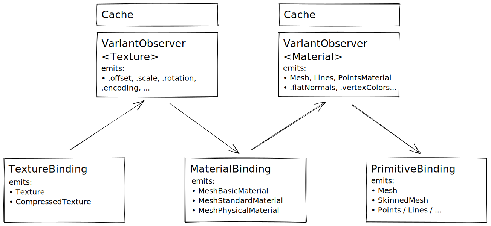

# @gltf-transform/render

[](https://www.npmjs.com/package/@gltf-transform/render)
[](https://bundlephobia.com/result?p=@gltf-transform/render)
[](https://github.com/donmccurdy/glTF-Transform-Render/blob/main/LICENSE)
[](https://github.com/donmccurdy/glTF-Transform-Render/actions?query=workflow%3Abuild)

> _**IN DEVELOPMENT:** This project is currently in development, and missing some functionality._

Syncs a glTF-Transform [Document](https://gltf-transform.donmccurdy.com/classes/document.html)
with a [three.js](https://threejs.org/) scene graph, keeping three.js updated
over time as changes are made to the Document. After changes are complete,
export the exact glTF document — losslessly — with the
[glTF-Transform NodeIO / WebIO](https://gltf-transform.donmccurdy.com/classes/core.platformio.html)
tools.

## Motivation

While three.js can render glTF 2.0 files out of the box with
[THREE.GLTFLoader](https://threejs.org/docs/index.html#examples/en/loaders/GLTFLoader),
and export them with [THREE.GLTFLoader](https://threejs.org/docs/index.html#examples/en/loaders/GLTFLoader),
this approach has an important limitation: the GLTFExporter → GLTFLoader
trip is lossy, and doesn't support all features of glTF. For a small set
of closely-controlled assets, this might be a good workflow. But in
general, it is error-prone.

Another alternative might be to apply changes in glTF-Transform, export with
[WebIO](https://gltf-transform.donmccurdy.com/classes/core.webio.html),
and reload with THREE.GLTFLoader. This workflow is accurate, but slow to
repeat — even a simple change to a material parameter requires reloading the
entire file.

**`@gltf-transform/render` provides a tighter integration between a glTF
Document and a three.js scene graph**, so that changes to the Document
(e.g. [Material](https://gltf-transform.donmccurdy.com/classes/material.html)
settings) are shown _instantly_ in the rendered result. In addition, any
features that three.js doesn't support won't be lost — they just aren't
rendered in the preview.

Basic workflow:

1. Load a glTF [Document](https://gltf-transform.donmccurdy.com/classes/core.document.html) with glTF-Transform's [WebIO](https://gltf-transform.donmccurdy.com/classes/core.webio.html)
2. Construct three.js scene with `DocumentRenderer`
3. Begin ~60 FPS render loop
4. Apply changes to [Document](https://gltf-transform.donmccurdy.com/classes/core.document.html); update `DocumentRenderer` state

The cost of this fast edit/refresh loop is a somewhat slower first-time load
and additional memory overhead, so the project is not meant to replace
THREE.GLTFLoader for most users.

## Quickstart

Install:

```
npm install --save @gltf-transform/render
```

## API

```typescript
import { Scene, WebGLRenderer, PerspectiveCamera } from 'three';
import { GLTFRenderer } from '@gltf-transform/render';
import { WebIO } from '@gltf-transform/core';
import { KHRONOS_EXTENSIONS } from '@gltf-transform/extensions';

// Set up three.js scene.

const scene = new Scene();
const camera = new PerspectiveCamera(50, window.innerWidth / window.innerHeight, 1, 10);
const renderer = new WebGLRenderer();
// ...

// Load glTF Document.
const io = new WebIO().registerExtensions(KHRONOS_EXTENSIONS);
const document = await io.read('./input.glb');
const documentRenderer = new GLTFRenderer(document);

// Add the GLTFRenderer's output to the scene (just once).
const groupDef = document.getRoot().listScenes()[0];
const group = documentRenderer.render(scene);
scene.add(group);

// When glTF Document is edited, trigger change detection.
const materialDef = document.getRoot().listMaterials()[0];
documentRenderer.update(materialDef); // partial update
documentRenderer.update(groupDef);    // full update

// Render.
function animate () {
	requestAnimationFrame(animate);
	renderer.render(scene, camera);
}
```

### Bindings

| binding   | status | comments     |
|-----------|--------|--------------|
| Scene     | ✅     | Dynamic      |
| Node      | ✅     | Dynamic      |
| Material  | ✅     | Dynamic      |
| Texture   | 🚧     | Static       |
| Mesh      | 🚧     | Static       |
| Primitive | 🚧     | Static       |
| Animation | ❌     | No bindings  |
| Camera    | ❌     | No bindings  |
| Light     | ❌     | No bindings  |

**Legend:**

- ✅&nbsp;&nbsp;Renders and updates
- 🚧&nbsp;&nbsp;Static render, no updates
- ❌&nbsp;&nbsp;Not rendered

## Bugs / Limitations / To Do

See https://github.com/donmccurdy/glTF-Transform-Render/issues/8.

### Extensions Supported

See https://github.com/donmccurdy/glTF-Transform-Render/issues/7.

## Contributing

```shell
# Install dependencies.
yarn

# Build source, watch for changes.
yarn watch

# Build source, watch for changes, and run examples.
yarn dev

# Run tests.
yarn test
```

<!---

### Structure

One of more interesting challenges of this project is that glTF properties do not necessarily map 1:1 to class instances in a particular 3D library like three.js. Examples:

- a glTF "Primitive" maps to THREE.Mesh, THREE.SkinnedMesh, THREE.Points, THREE.Lines, etc., depending on its content. While this is a 1:1 relationship, if the Primitive's content changes, the bindings may need to replace (not mutate) the existing three.js class instance.
- a glTF "Material" maps to THREE.MeshStandardMaterial, THREE.MeshBasicMaterial, or THREE.MeshPhysicalMaterial depending on its content. Additionally, the context in which the Material is used (points? lines? mesh? skinned mesh?) may require changing the class (e.g. PointsMaterial) or properties of the material (e.g. `.vertexColors` or `.flatNormals`). This is a 1:many relationship, since a Material may be reused in multiple contexts throughout the glTF document.

To support these cases, this library defines concepts of "bindings" (observing a glTF source property) and "variants" (observing contextually-derived versions of the property). Either type of observer may emit a replacement object when content changes.



--->
